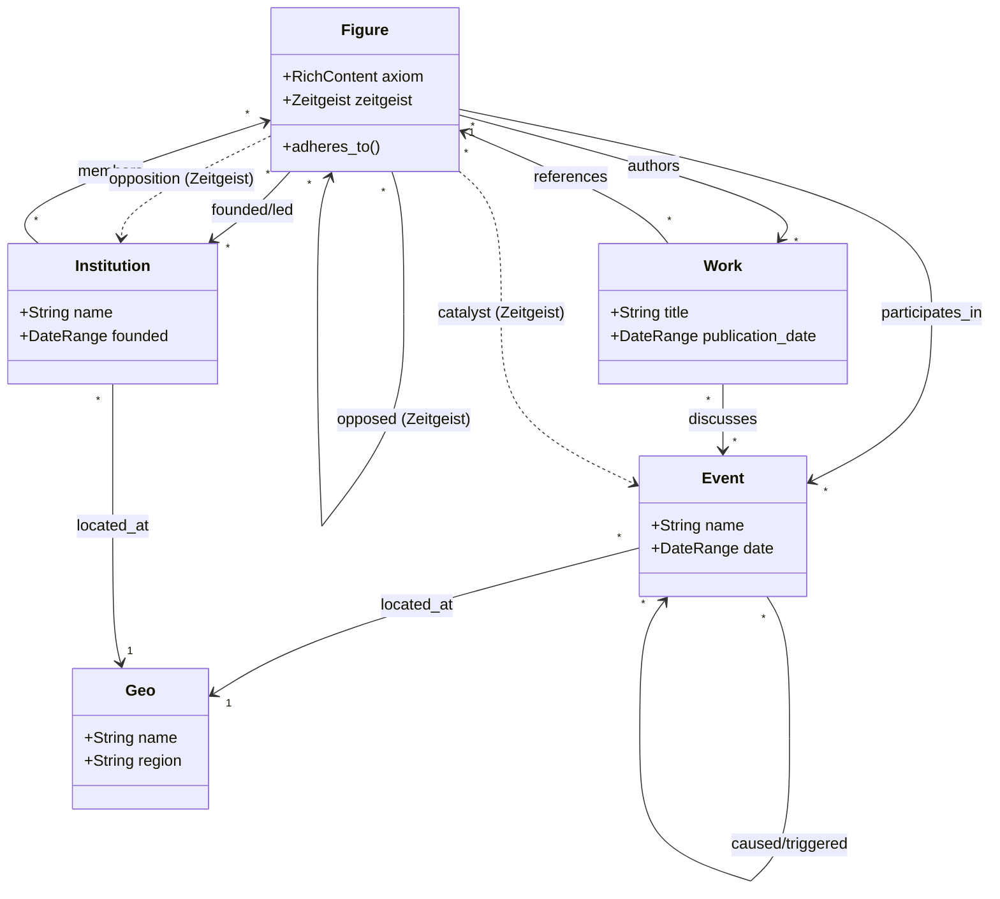

# Encyclopedia Domain Model

The core domain model for the Encyclopedia feature, designed to support a rich, interconnected knowledge graph of historical figures, works, events, and institutions.

## Core Concepts

### 1. Rich Content (`RichContent`)
Instead of plain strings, descriptive fields use `RichContent` to enable wiki-style hyperlinks to other entities.

- **Structure**: `Vec<ContentSegment>`
- **Segments**:
  - `Text(String)`: Plain text.
  - `EntityRef(EntityRef)`: A typed link to another entity (e.g., linking "The Republic" to the Work entity).
  - `DateRef(DateRange)`: Inline date reference.

### 2. Entity References (`EntityRef`)
A lightweight, typed reference to another entity, used for relationships and hyperlinks.

- **Fields**: `id` (UUID), `entity_type` (Enum), `display_text` (String).
- **Usage**: Used in `RichContent` and structural fields like `authors`, `influences`, `participants`.

### 3. The Zeitgeist (`Zeitgeist`)
Captures the historical context surrounding a figure.
- **Catalyst**: What triggered their work? (Event/Condition).
- **Opposition**: What did they oppose? (Figure/Institution/Idea).
- **Influences**: Who taught or inspired them? (List of Figures).

## Entity Overview

| Entity | Description | Key Relationships |
|--------|-------------|-------------------|
| **Figure** | A historical person (philosopher, leader). | Authors `Work`, participates in `Event`, influenced by `Figure`. |
| **Work** | A creative output (book, treatise, art). | Authored by `Figure`. |
| **Event** | A historical occurrence (war, treaty). | Participants (`Figure`), Location (`Geo`). |
| **Institution** | An organization (school, party, empire). | Founders (`Figure`), Location (`Geo`). |
| **Geo** | A physical location (city, region). | Referenced by all. |

## relationships Visualization

The following diagram illustrates how entities are interconnected in the domain graph:

## Data Storage

- **Graph**: In-memory `petgraph` (`EncyclopediaGraph`) for traversal and analysis.
- **Persistence**: SQLite (`EncyclopediaDb`) for reliable storage of entity data and relationships.
